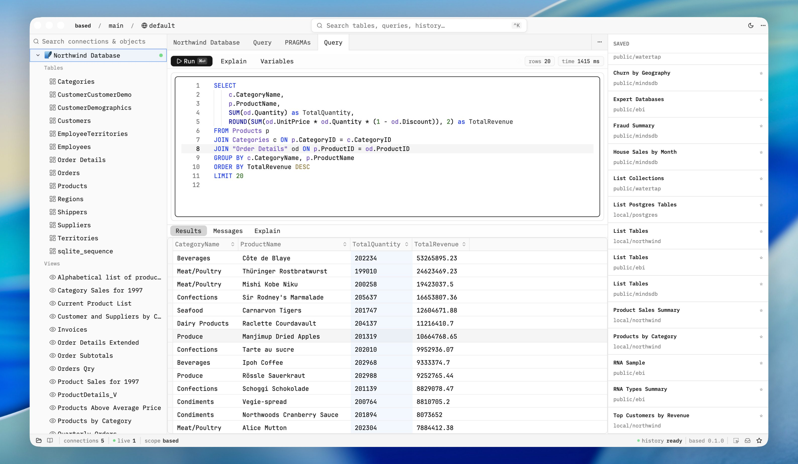

# Based

Based is a local-first desktop database client written in Rust and GPUI. Instead of keeping connections and queries as private, machine-local state, it reads a `.based/` folder in your repository: connections and saved queries are small TOML files your team reviews in pull requests, while secrets stay in a gitignored `.env`. There is no backend service and no account to sign up for. Connections go straight from the app to your database, with no proxy and no telemetry in the middle.

## One folder, committed to git

A `.based/` project holds `project.toml` for shared settings, one file per connection under `connections/` and one file per saved query under `queries/`. Small files mean small diffs and few merge conflicts, so a new teammate clones the repo and has every host, port and database ready. Passwords and tokens are referenced through environment variables and documented in a committed `.env.example`, never as literals in a connection file. Favorites, run history and personal UI state are kept per user outside of git.

## Three engines, side by side

PostgreSQL is the primary engine, with schemas, SSL modes, test-before-connect and everyday parity across local, staging and production. SQLite connections are file-backed, with journal mode, synchronous and foreign-key PRAGMAs set right in the connection file. MongoDB collections and aggregations live in the same project as your SQL connections, and each connection file picks its engine.

## Productive SQL editor

A multi-tab editor with syntax highlighting, one-key formatting and autocomplete. Run the selection, the current statement or the whole script, and cancel a long run. Queries can be parameterized with user variables and built-in `{{$…}}` injection, so the same saved query works across environments without edits. An Explain tab shows the plan beside the results.

## Fast schema explorer

Browse schemas, tables, views, indexes and functions in a responsive tree. Search across every connection and object from one box, and open a table's data or DDL instantly.

## Safe data editing

Inline-edit rows in the results grid with an explicit dirty state and save or discard. Writes never happen behind your back.

## History, favorites and the command palette

Every run is saved to a searchable local history, and the queries you reach for most can be pinned as favorites and rerun in seconds. A command palette drives everything from the keyboard: new query, connect, refresh, format, run, history.

## Native and local-first

Built on the same GPU-accelerated UI framework as Zed, Based ships native builds for macOS, Windows and Linux, with light and dark themes and in-app updates on release builds.

[Website](https://based.pavi2410.com) · [GitHub repository](https://github.com/pavi2410/based)
