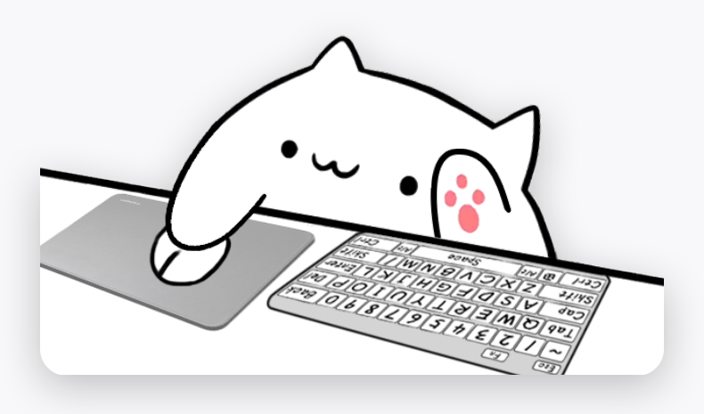
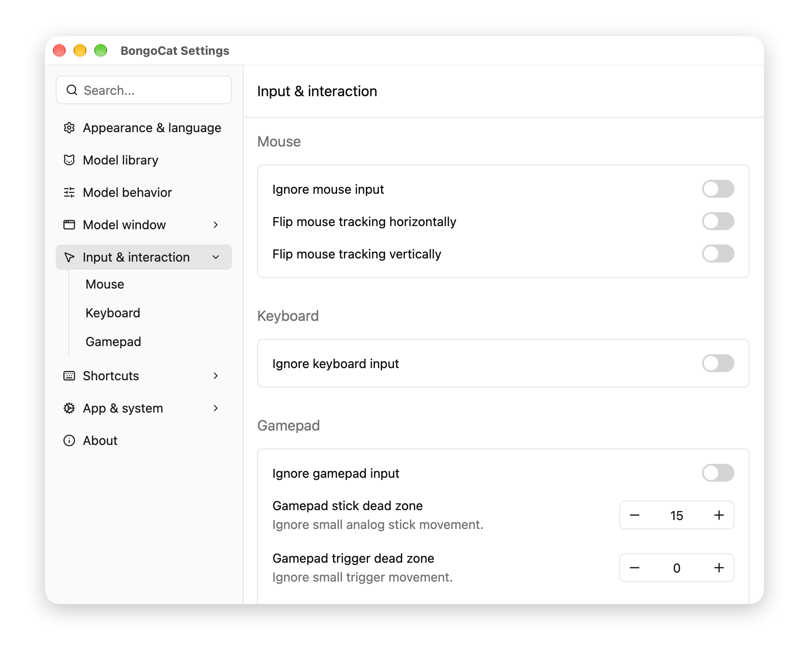
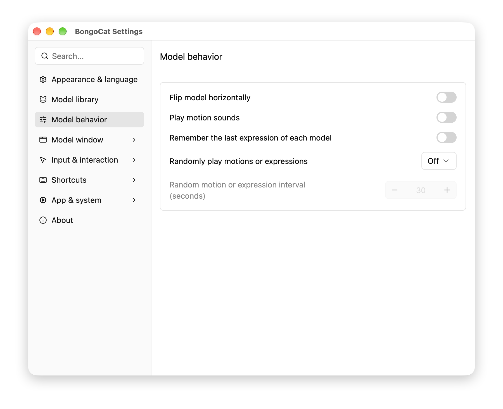
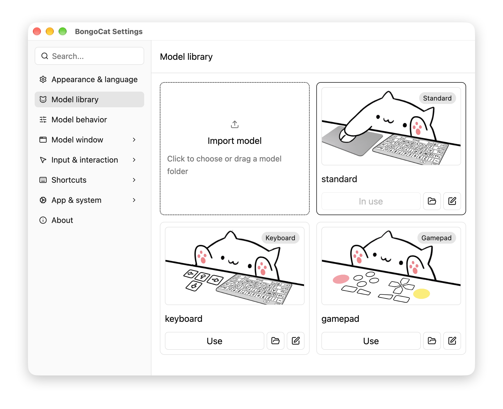
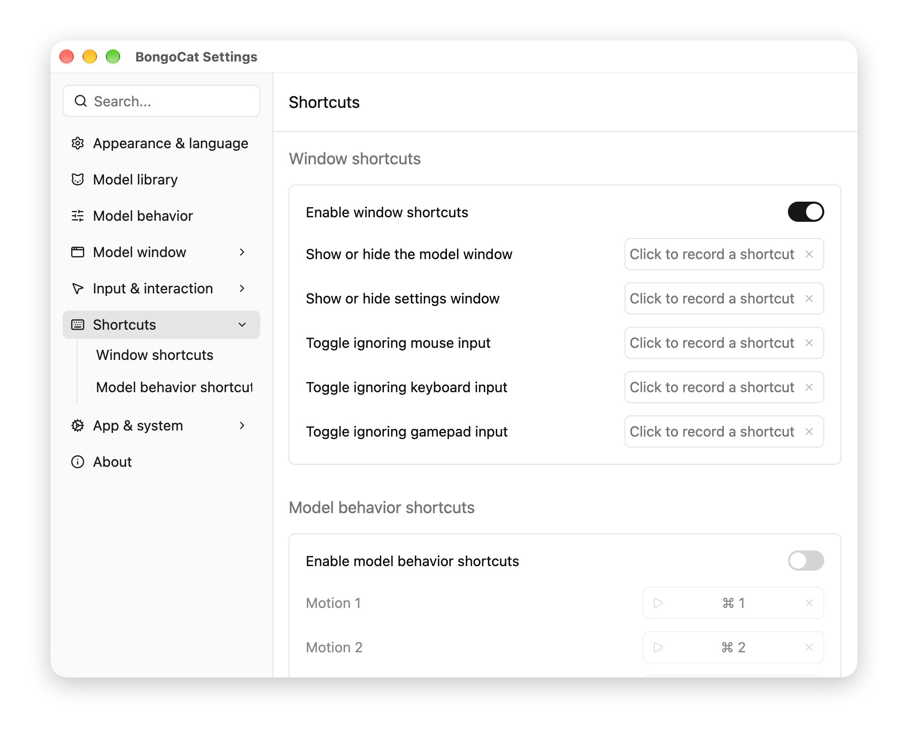
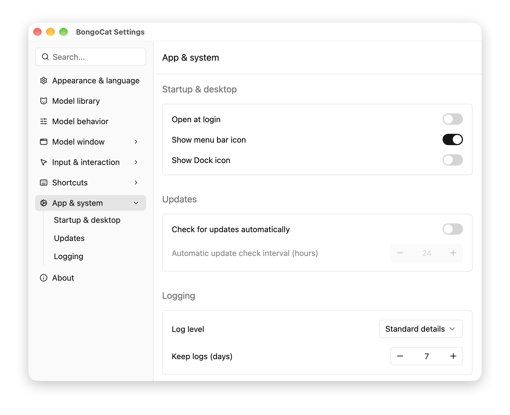

# BongoCat

BongoCat is a desktop companion for macOS and Windows. A Live2D cat lives on your screen: its eyes and
paws follow your mouse, and it plays a motion for every key, mouse button and gamepad button you press.
It sits quietly in a corner until you want it again. BongoCat is written in Rust, the settings window is
built with gpui-kit, and the cat itself is drawn by a native Metal or D3D11 renderer that is completely
separate from the settings UI.

## The cat on your desktop

The model window is a frameless overlay that you can drag anywhere, resize, scale, make more or less
transparent and round the corners of. It can stay above other windows, let mouse clicks pass straight
through it, stay inside the screen edge, or hide when the pointer comes near and come back after a delay
you choose. A frame rate cap keeps it quiet on a laptop battery.

## A cat that answers every press

Keyboard, mouse buttons and gamepad buttons are three independent inputs, and each one can be muted on
its own from a global shortcut, so the game you are playing never makes the cat twitch. Mouse tracking can
be flipped horizontally or vertically when the cat should follow the pointer the other way. Gamepad sticks
and triggers have their own dead zones, and the model can switch by itself when a controller connects or
disconnects, or stay pinned to the model you picked.

## Make the model behave the way you like

Mirror the model horizontally, play motion sounds, and let the cat play random motions or expressions on
an interval you set instead of sitting still. Each model remembers the expression you last used on it, so
switching back to a favourite cat brings back the look you left it in.

## Bring your own model

BongoCat ships with a small set of built-in models, and the model library imports your own Live2D models
from a folder you choose or drag onto the window, with the cover image captured for you. Models can be
renamed and given a new cover, and apps made with Bongo-Cat-Mver are converted on import. A model that
fails to load never takes the current one down: the cat you already have stays on screen while the new one
is validated.

## Shortcuts you decide

Global shortcuts open the settings window, mute an input source and trigger model behavior, and the two
shortcut groups have independent switches, so window shortcuts can stay on while model shortcuts are off.

## Quiet by default

BongoCat can open at login, keep a menu bar or taskbar icon, check for updates on an interval, and keep
logs only for as long as you want, at the level you want. An automatic update checks the version, the
platform and the signature before anything is replaced, and a failed update rolls back.

## Open and offline

BongoCat is open source under the Apache License 2.0. It never touches the network while you use it,
collects nothing, and every model, setting and log stays in a plain file in your own user directory.

[GitHub repository](https://github.com/ayangweb/BongoCat)
