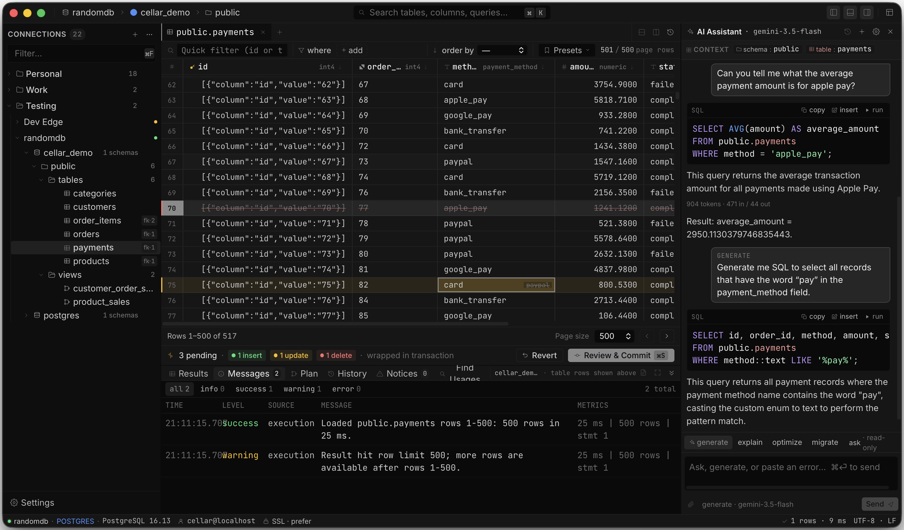

# Cellar

Cellar is an open-source desktop database client for developers, DBAs and analysts who spend their day in SQL. It is a native GPUI application written in Rust, so the window, the sidebar tree and the data grid are all drawn natively with a dense, keyboard-first layout. There is no account, no telemetry and no cloud sync: connections live on your machine and credentials are stored in the OS keychain.

## Browse and query

Connections are organized into groups in the left sidebar, and each database expands into schemas, tables and views with foreign-key hints next to every table. Open a table to browse its rows, or open a SQL tab to write and run queries with history, notices and timing for every statement. Execution plans have their own panel, so `EXPLAIN` output is a click away from the query that produced it. The command palette (⌘ K) searches tables, columns and queries across the current connection.

## A grid built for real data

The result grid is virtualized in both directions, so wide tables and large result sets stay smooth. Cells are editable in place, and every insert, update and delete is kept as a pending change that is highlighted in the grid and counted in the footer. Rows can be multi-selected from the gutter for copy and bulk delete. A quick filter, per-column filters with type-aware pickers for booleans, dates and times, and an order-by selector sit above the grid, and saved presets make common views one click. Text values with line breaks, such as pretty-printed JSON, are shown on a single line with markers and keep their real content when edited or copied.

## Review before you commit

Pending edits are wrapped in a transaction and never reach the database until you ask. Review & Commit shows the exact SQL that will run, and Revert throws the whole batch away. Reloading, sorting or filtering a table protects edits made in the meantime instead of discarding them.

## AI in the workflow

The AI assistant panel sits beside the grid and knows the current schema and table as context. Ask a question in plain language, generate, explain, optimize or migrate SQL, or paste an error and ask what went wrong. Generated statements come back as inspectable SQL that can be copied, inserted into the editor or run. Cellar talks to your own provider directly, with OpenAI, ChatGPT subscription sign-in, DeepSeek and Gemini models supported, and the model can be switched inline from the composer. No request passes through a hosted Cellar service.

## Status

Cellar is in early access. PostgreSQL is the complete vertical slice today, covering connection management, schema browsing, query execution, query history, execution plans and the editable grid. SQL Server and Azure SQL support is in progress, and drivers, AI providers, exporters and renderers are designed to be pluggable.

[GitHub repository](https://github.com/MRL-00/cellar)
