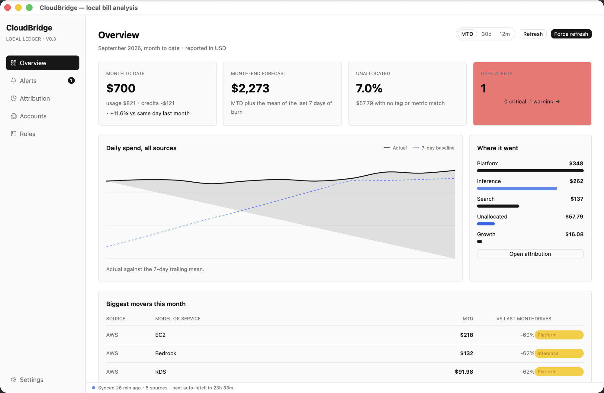

# CloudBridge

CloudBridge is a local-first desktop ledger for everything an individual developer spends on cloud infrastructure and AI models. It brings AWS, Alibaba Cloud, DeepSeek, Volcengine, OpenAI and Anthropic spend into one native window, one currency, on one machine. Built with Rust and GPUI through gpui-kit, it runs on macOS and Windows and builds from source on Linux. Credentials stay in the OS keyring, nothing syncs to a cloud, and there is no telemetry.

## Clouds and model providers

AWS and Alibaba Cloud are read through their billing APIs, and DeepSeek reports its prepaid balance. For providers whose console offers a bill export rather than an API, point CloudBridge at the downloaded file: Alibaba Cloud Model Studio, Volcengine Ark, OpenAI, Anthropic and DeepSeek all import per model, so AI spend appears at the same granularity as cloud services. An import replaces every month the file covers, the original file is kept so a mapping fix replays it, and a usage export that carries no amounts is recorded as usage rather than priced at list.

## Overview

Pick month to date, the last 30 days or the last 12 months, and every number on the page follows the selection. The headline total is net of credits, with gross usage and the credits that took it down shown beside it. A month-end forecast extends the current burn, a daily trend is drawn against its 7-day baseline, "Where it went" splits usage across business lines, and the biggest movers table ranks services and models by their change against the comparison window. The unallocated share, the part of the bill that reaches no business line, is a figure of its own.

## Alerts and rules

Three rules ship enabled and are tunable on the Rules page: a source's service running far above its own 7-day trailing baseline for days running, a prepaid balance heading for the floor, and a month where too much usage carries no tag. Each alert says what it saw, the baseline it broke and where the month ends if the condition holds. Resolve, snooze or dismiss it, and a condition that stops holding is resolved for you on the next load.

## Attribution

The Attribution page draws the month as a Sankey from source to service or model to business line, with an explicit Unallocated node so the unexplained part of the bill is visible rather than hidden. Flows run on gross usage, and a charge reaches a business line through its tag.

## Accounts

Each account has its own drill-down with the same range control, a net, gross and credits stat row, a daily or monthly usage trend, and a per-service table with each service's share of the window and its change against the comparison window.

## One currency, one ledger

Charges are stored in the currency they were billed in and converted for display at a rate dated no later than the charge itself. Change the reporting currency in Settings and nothing is rewritten. Every source normalizes into a single fact table named after FOCUS columns, so credits, refunds, taxes and fees are each labelled as themselves, raw provider responses are kept locally so a mapping fix never costs another paid API call, and re-ingesting an unchanged bill produces identical rows.

## Frugal with paid APIs

A billing period is re-fetched at most once per refresh interval, 24 hours by default and adjustable in Settings. Refresh picks up anything past the interval, Force Refresh re-fetches now, and a month you imported from a file is never replaced by either. A demo dataset in Settings loads three accounts and twelve months of realistically shaped ledger so you can explore the app before connecting anything.

[Website](https://cloudbridge.jetsquirrel.cloud) · [GitHub repository](https://github.com/JetSquirrel/cloudbridge)
