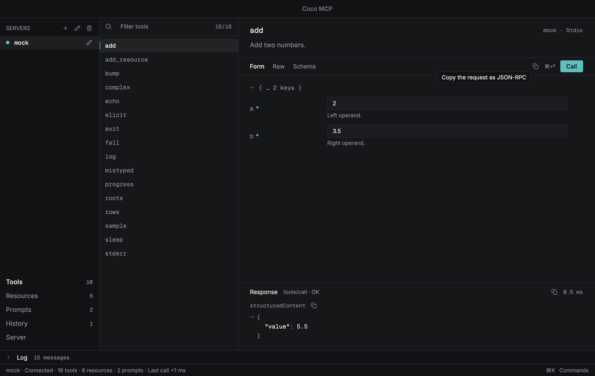
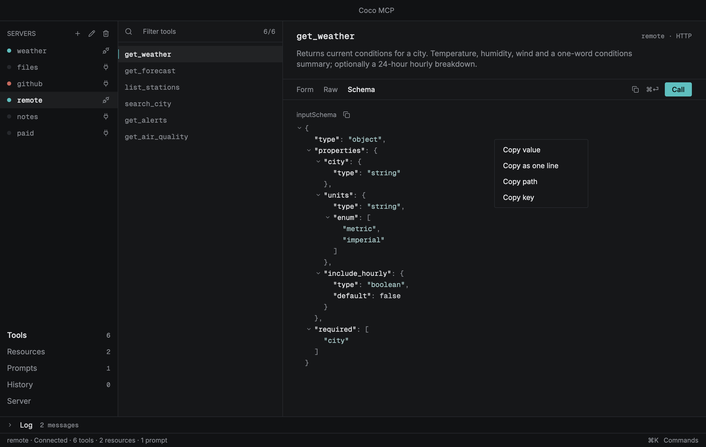
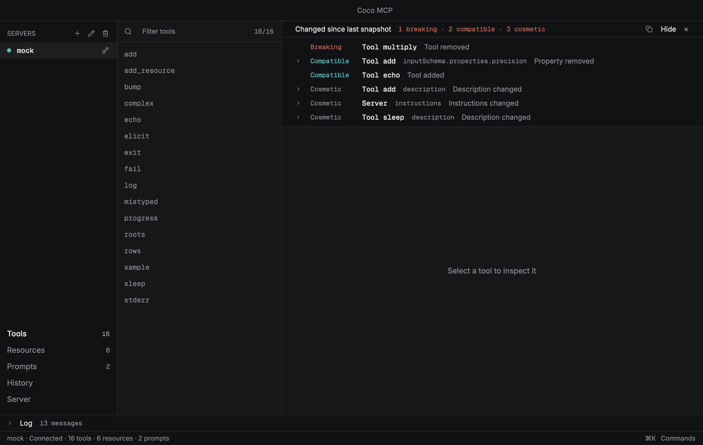

# Coco MCP

Coco MCP is a tool for inspecting and debugging Model Context Protocol servers: connect to one, see what it offers, call it with any payload, read every message on the wire, and keep what you learned. It is one binary written in Rust and drawn by GPUI. The same core powers a command line for scripts and CI and a native window for interactive work, so what one shows, the other can script.

## Any payload, many servers

The Raw tab next to the generated form takes whatever JSON you paste, checks it against the tool's schema before it is sent, and copies the request as JSON-RPC exactly as it goes out. Every server in the sidebar has its own session, wire log and history, all connected together; switching between them is a click or a keystroke in the command palette. Stdio servers are any command line, and HTTP servers take custom headers, bearer tokens or OAuth 2.1 with PKCE and dynamic registration. Secrets live in the OS keyring, never in the database.

## Browse, call and read

Tools, resources, resource templates and prompts are listed with an inline filter and keyboard navigation. A tool is called through a form generated from its JSON Schema, with nested objects, arrays, enums and oneOf, or by editing the raw JSON; arguments are validated before they are sent. Responses appear as collapsible JSON, text, Markdown or images with round-trip times, and every wire message lands in a filterable log drawer where a row unfolds into the same tree as a response. A reconnect keeps the previous connection's messages above a separator, so the reason a server stopped is still there.

## Answer the server

Server-initiated requests are shown as dialogs instead of being auto-rejected: elicitation forms, sampling and roots. Both eras of the protocol are supported, from the initialize handshake through the sessionless 2026-07-28 revision, chosen per server. A feature the agreed version or the server does not support stays on screen, dimmed, and says why on hover.

## Remember and notice changes

Servers, calls and snapshots persist. The History view replays a call or loads its arguments back into the form, and its filter matches a call's name, arguments, result and error. Each connect is compared with the last stored snapshot and a banner classifies every difference as breaking, compatible or cosmetic, direction-aware for input and output schemas. The command line runs the same diff and exits with a failure on a breaking change, so a server regression can fail a CI job.

## Take it away, bring it in

Right-click any node of any tree to copy its value, its path or its key; copy a whole response, a tool's schema or a request as JSON-RPC; write the snapshot, the wire log, the call history and the client config to files. Bearer tokens are redacted everywhere except the one action named for them. An mcpServers file from another MCP client can be imported, adding every server it names at once with any token it carried moved into the keyring.

## Built in Rust, drawn by GPUI

The window is a single native binary rendered on the GPU through Metal or Vulkan: nothing to boot before the first frame, no runtime and no browser process beside it. Lists build only the rows in view and large results respect a drawing budget, so a long session costs no more per frame than a short one. The protocol client, storage, schema forms, diff and export formats are plain Rust crates with no UI in them, and every screen in the project's documentation is produced by a headless test that drives the real window against a mock server.

[GitHub repository](https://github.com/camiloazula/coco-mcp)
