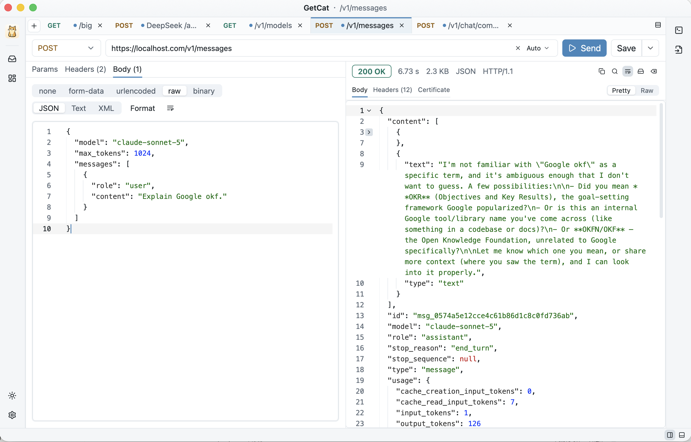
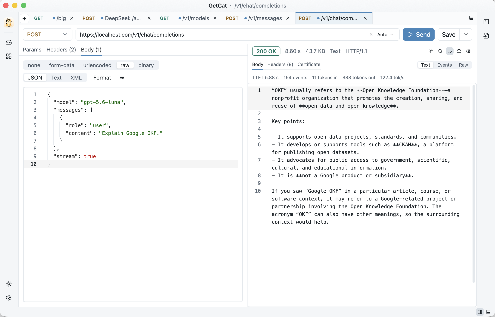
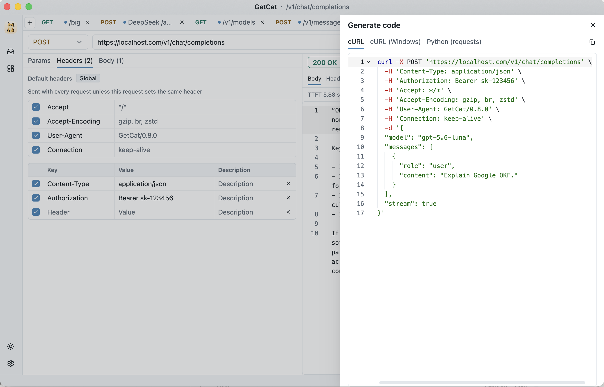

# GetCat

GetCat is a native desktop app for sending HTTP requests and inspecting the responses, the everyday tool of anyone who builds or consumes web APIs. It is written in Rust on GPUI, the GPU-accelerated UI framework behind the Zed editor, so the window is drawn natively on macOS, Windows and Linux with the same custom title bar and the same layout on every platform. There is no Electron, Tauri or WebView underneath, no account to create and nothing is uploaded anywhere: saved requests, drafts and settings are pretty-printed JSON files on your own disk.

## Build any request

Pick GET, POST, PUT, PATCH, DELETE, HEAD or OPTIONS, type the URL and press ⌘ Enter. Path parameters written as `{name}` in the URL appear automatically in the path table, while query parameters and headers live in their own tables with per-row toggles and descriptions. Bodies can be multipart form-data with text and file fields (files are streamed with a known length), x-www-form-urlencoded, raw JSON, text or XML, or a single binary file. Default headers apply to every request and can be overridden per request, and the HTTP version can be forced or left on auto.

## Responses that stay smooth at any size

Responses stream in with live progress and can be cancelled at any moment. Bodies up to 5 MB open in a syntax-highlighted editor with search; up to 64 MB they are rendered line by line through a virtualized view that stays selectable and copyable; anything larger spills to disk with a preview and a one-click save. A few hundred megabytes never freezes the interface. Status, timing, size, detected content type and HTTP version sit on one status line, body and headers each have a copy button, and a Certificate tab shows the server's certificate chain with a health check for expired, not-yet-valid or mismatched certificates.

## Watch LLM streams as they arrive

Server-sent events render as they come in, so there is no waiting for a stream to finish. The stream formats of OpenAI Chat Completions, OpenAI Responses and Anthropic Messages are recognized automatically and shown in three views: the event list, the assembled text and the raw stream. Time to first token, event count, token usage and generation rate are computed alongside. The sidebar ships request templates for all three APIs (plain text, with image and streaming) and for both generations of the MCP protocol.

## Commands in, commands out

The right-hand rail turns the current request into a snippet for Python or cURL, and the snippet is guaranteed to match what GetCat actually sends because both come out of the same request pipeline. It also works the other way: paste a command copied from a browser (Copy as cURL) and it becomes a new tab, with anything that could not be carried over listed explicitly.

## Saved requests, drafts and your own files

⌘ S saves a request to the sidebar under an optional category, and every open tab keeps a draft that survives restarts. Everything is stored as readable JSON in a per-user data directory, so it can be hand-edited, backed up or tracked in Git. Writes are atomic, and a file that fails to parse is set aside instead of blocking startup. There is no history, no stored responses and no telemetry.

## Native on three platforms

Light and dark themes follow the system or can be pinned. Every control has an accessible name and works with screen readers. Native builds ship for macOS, Windows and Linux, with in-app updates verified by checksum and signature, and the interface is available in English and Simplified Chinese.

[Website](https://getcat.io) · [GitHub repository](https://github.com/finch-xu/GetCat)
