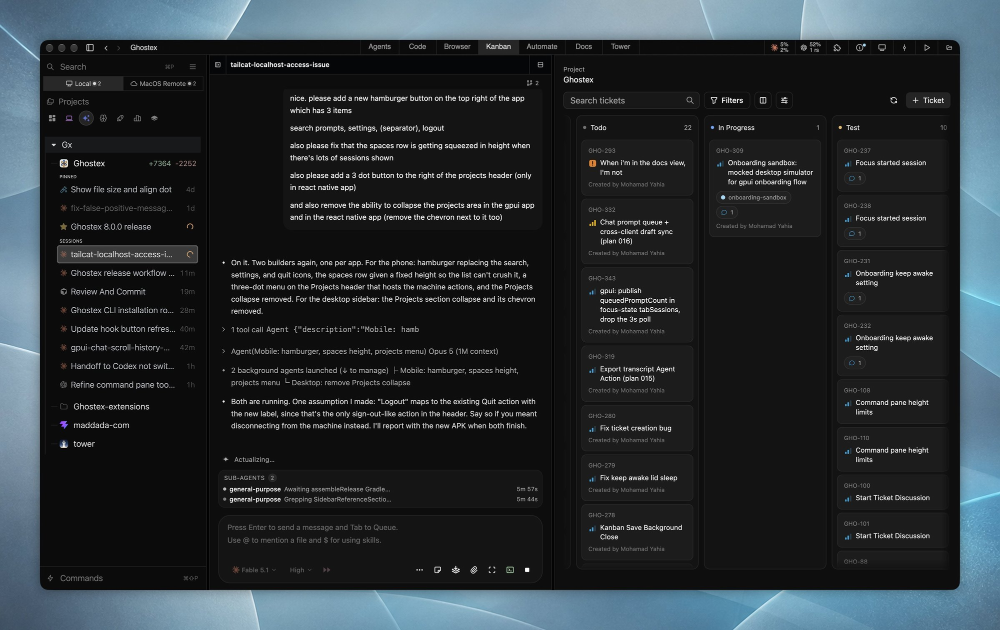
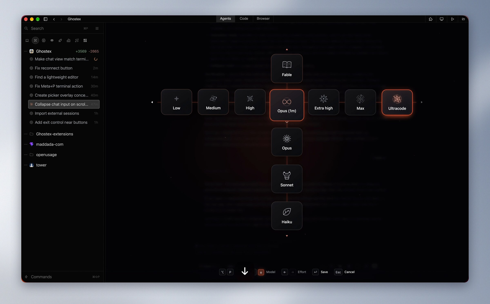
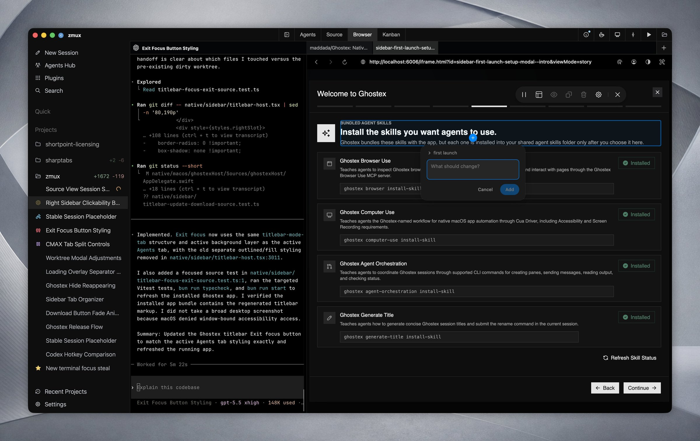
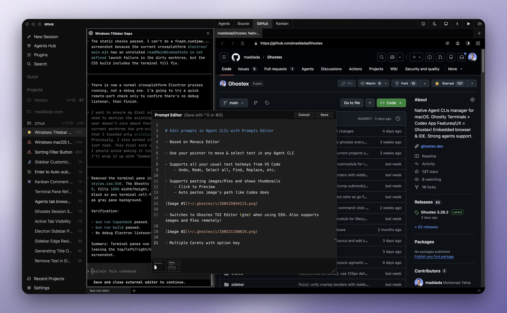
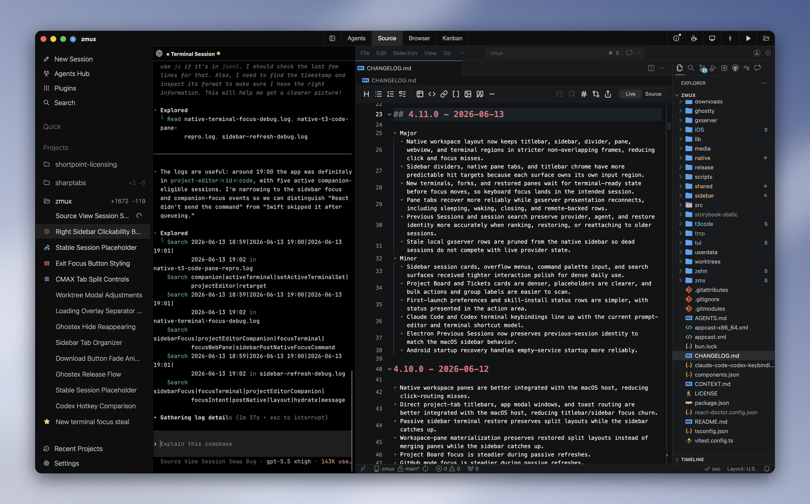

# Ghostex

Ghostex is the native desktop app for Claude Code, Codex, OpenCode and every other coding agent. It is built for developers who keep many agents alive at once: a chat view for every agent, a native Rust/GPUI shell, embedded Chromium panes and a mobile app share one workspace, and every session survives restarts.

## A real chat view for every agent

Talk to Claude Code, Codex or any other agent in a proper chat interface with clickable images, readable diffs, queued prompts, sub-agents in view and a full editor for long messages. The raw CLI is one hotkey away and the current draft comes along. Sessions are grouped by project in the sidebar, pinned or starred, and fuzzy search finds any prompt ever sent across all agents and projects so a conversation can be resumed with one keystroke.

## Any agent, swapped on the fly

Ghostex works with Claude Code, Codex, OpenCode, Pi, Gemini CLI, Grok, Cursor, Copilot CLI and more. A radial picker switches the model and effort level of the current session, and a session can be handed from one agent to another in the middle of a task.

## Embedded browser and annotations

The embedded Chromium browser lives beside the agent. Click any element on a page, type what should change, and the note lands in the agent's prompt. Browser profiles, Chrome DevTools MCP and a bundled browser-use skill let agents drive tabs themselves. The Docs view does the same for Markdown, HTML prototypes and Excalidraw diagrams: select anything, leave a note, and Ghostex turns the annotations into instructions the agent can act on.

## Prompt editor and built-in IDE

Any prompt can be opened in a rich editor with familiar text hotkeys, multiple carets, pasted image previews and no more uneditable pasted blocks. A VS Code based editor loads on demand for Markdown, code review and pull requests, supports extensions and sleeps when it is not in use.

## Kanban, orchestration and remote machines

A Kanban board backed by the Beads CLI lets humans and agents share one backlog, so an orchestrator agent can farm tickets out to sub-agents. Agents can open sessions, send prompts and read replies from other agents through the Ghostex command line. Install the server component on another computer, connect with an Easy Connect code or SSH, and its projects appear in the sidebar next to local ones.

## Also in the box

Usage and account limits for Claude and Codex at a glance with automatic account switching, a worktree per task with merge-back, splits and Arc-style spaces, scheduled prompts and hooks, menu bar and sound notifications, and iOS and Android companion apps that pair with a QR scan or over Tailscale to read transcripts, send follow-ups, preview localhost pages and receive a push when an agent finishes. Browser, Kanban, IDE, Docs and automations ship as optional extensions that load only when used.

[Official website](https://ghostex.dev) · [GitHub repository](https://github.com/maddada/Ghostex)
