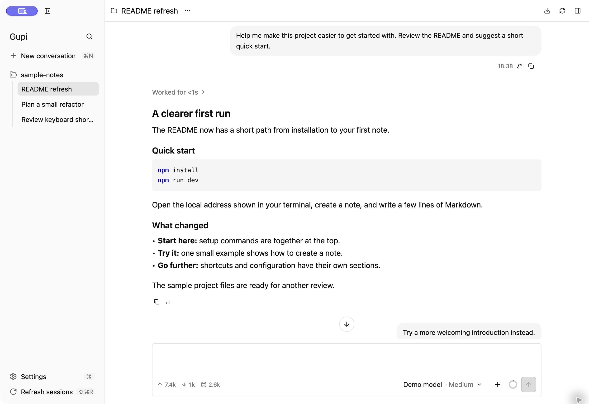
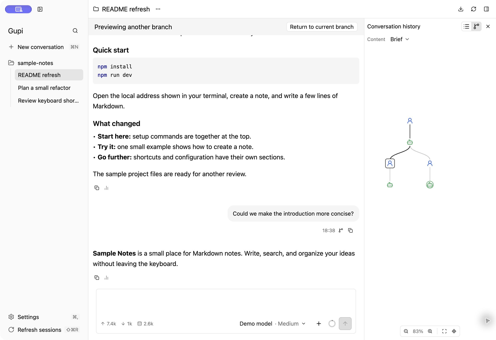
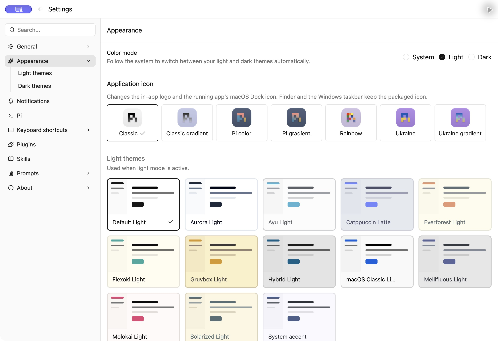

# Gupi

Gupi brings the Pi coding agent into a native desktop workspace built with Rust and GPUI Kit. It organizes conversations around projects, presents model responses and tool activity, and makes branching session history easier to explore.

## Keep project work together

Move between project conversations in the sidebar and return to earlier sessions without losing their context. The conversation view supports streaming responses, formatted Markdown, code blocks and tool details. The composer brings together model and thinking-level selection, files, images, skills and reusable prompts.

Gupi uses Pi for model execution and session content. Existing Pi accounts, settings and sessions remain part of that workflow; Gupi provides the desktop interaction and connection lifecycle around them.

## Explore another direction

Conversation history can be viewed as a list or a branch tree. Preview another branch, inspect its messages, and return to the current conversation. This is useful when comparing alternate approaches, revisiting earlier decisions or continuing a task from a different point.

## Make room for quick tasks

Temporary conversations provide a place for short questions and tasks outside a project session. Configurable keyboard shortcuts and quick-task actions help bring the workspace into an existing desktop routine. In-app resource pages provide access to Pi skills, prompts and related personal resources.

## Choose a comfortable workspace

Appearance settings include light and dark themes, system color mode and application icon choices. Interface language, notifications and keyboard shortcuts are configurable. Gupi is available for macOS, Windows and Linux.

These images show the actual macOS application with a sample project and authored demonstration conversations. The example replies illustrate the interface rather than a model benchmark.

[Gupi source and product documentation](https://github.com/suxiaoshao/gupi)
