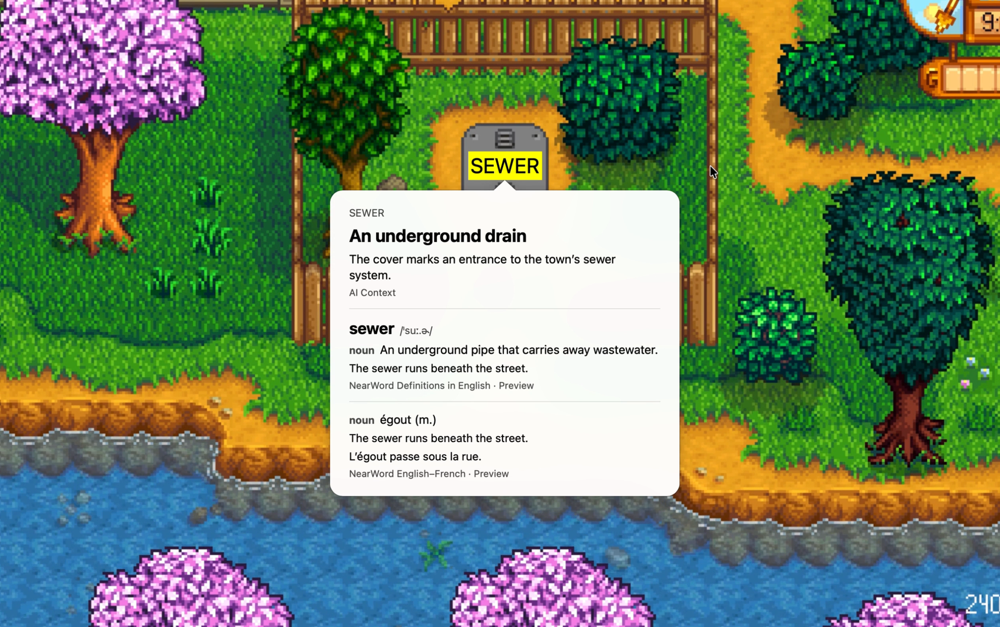

# NearWord

NearWord helps you understand unfamiliar words without leaving what you are reading. Point at a word, press a global shortcut, and see its meaning beside the source text. It works with text in webpages, PDFs, images, games and subtitles, without copying or selecting it.

## Look up a word or phrase

Downloaded dictionaries work offline, without an account. Optional AI Context explains meanings, idioms and phrases in the surrounding sentence; it requires an account and an internet connection. NearWord captures one frame when you trigger a lookup, with text recognition running on your device, not continuous screen recording.

## Find it again

Lookup history stays on your device. Search past lookups, reopen the answer and its original screenshot, or export your history to Anki, CSV or JSON.

## Desktop interface

The main desktop interface is written in Rust with GPUI Kit. On macOS, the default lookup panel uses native AppKit; the GPUI lookup surface is also available.

macOS is available now. Windows and Linux are in development, with early-access waitlist builds.

[Website](https://nearword.app/)
