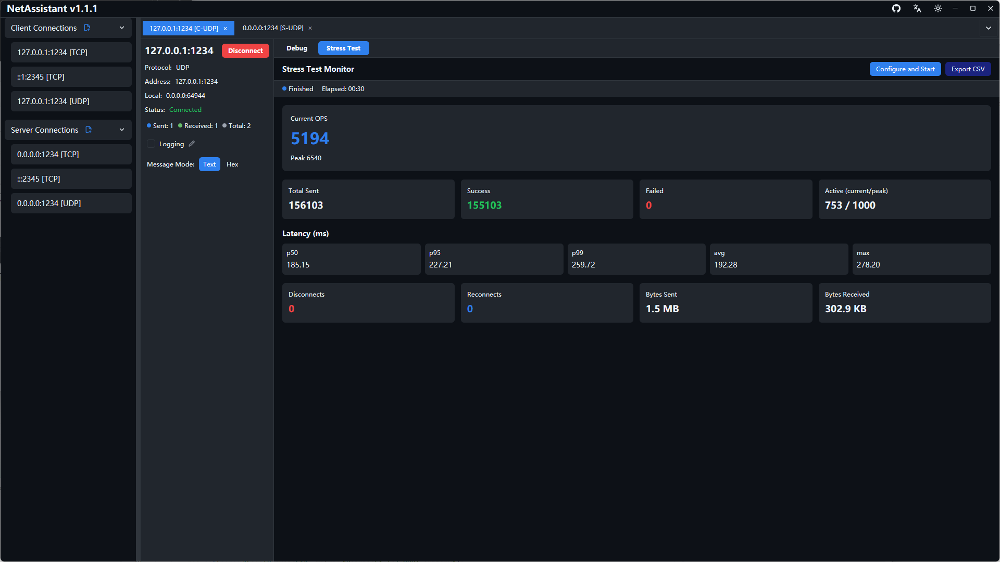
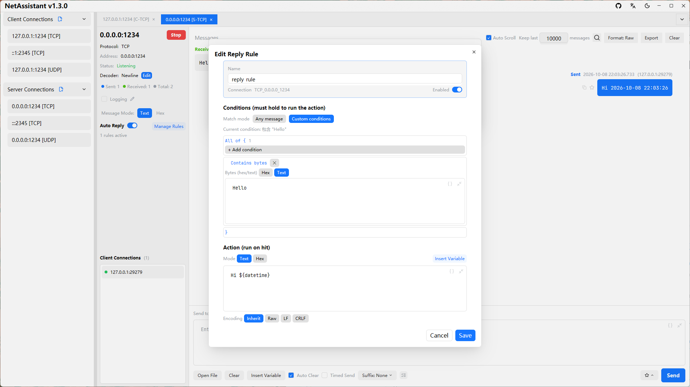

# NetAssistant

NetAssistant is a cross-platform network debugging tool for developers, built with Rust and GPUI Kit. It provides an intuitive chat-style interface for testing TCP and UDP communication in client and server modes, with IPv4 and IPv6 support, making it a handy companion for network application development, hardware debugging and embedded system work. It runs on Windows, Linux and macOS, ships in English and Chinese, and adapts to light and dark system themes.

## Connections and messages

Manage many connections at once as tabs, with per-connection protocol, address, decoder and status panels. The chat-style log shows every exchange with timestamps, supports one-click copy in text or hex, favorites with notes and keyword search, non-modal message search with hit counters and circular jumps, and an optional cap that keeps only the latest messages to control memory. Client connections can bind a specific local IP and port, and the UDP server mode lets you add client endpoints manually for device-discovery workflows where replies arrive from unexpected addresses and are highlighted in red.

## Decoders and hex editing

TCP decoders for raw data, line-based frames, length-prefixed frames and JSON solve sticky-packet problems, while the receive area can render JSON in raw, pretty or compact form. The built-in hex editor edits messages in hex and text views, converts ASCII and hex back and forth byte-exactly, loads file data sources in UTF-8, GBK or ANSI encoding with previews, and computes XOR, Sum8, LRC, CRC16-Modbus, CRC16-CCITT-FALSE and CRC32 checksums from a right-click menu.

## Automation

A per-connection rule engine answers incoming packets automatically. Conditions match on contained bytes, fixed-length exact or masked values, prefix plus length ranges, offset bytes and integers, frame tails, regular expressions, source addresses with CIDR and checksum verification, combined with all-or-any logic and negation at any nesting depth. Replies can reference received frame variables and dynamic values, rules can be reordered by drag and drop with hit statistics and inline trial runs. Send boxes, timed tasks and reply rules share a variable system with sequence numbers, timestamps, UUIDs, random ranges, frame fields and computed checksums. Multi-line send tasks and scheduled heartbeat tasks run with intervals, loops and round limits, all observable from a task panel.

## Stress testing

A built-in TCP and UDP stress engine drives high-concurrency load with live QPS, totals for sent, successful and failed operations, active connections, disconnects and reconnects, and byte counters. Ping-Pong mode measures round-trip latency with p50, p95, p99, average and maximum percentiles. Failures are classified by cause — connection, send, receive timeout, peer close or checksum — and results export to CSV. Configuration persists between runs; the panel above shows the engine configured in dark mode.

## Logs and export

Enable per-connection logging to write every message to disk asynchronously as it happens, with a custom path and automatic close on disconnect. Export the current message history to TXT, JSON or CSV at any time for archiving or further analysis.

## Keyboard friendly

Global shortcuts cover sending, tab switching, new connections, message search and focusing the input box from any focus state, so the tool stays fast during long debugging sessions.

NetAssistant is actively developed, with regular releases documented on its website.

[Official website](https://netassistant.trydo.top/) · [GitHub repository](https://github.com/SunJary/NetAssistant)
