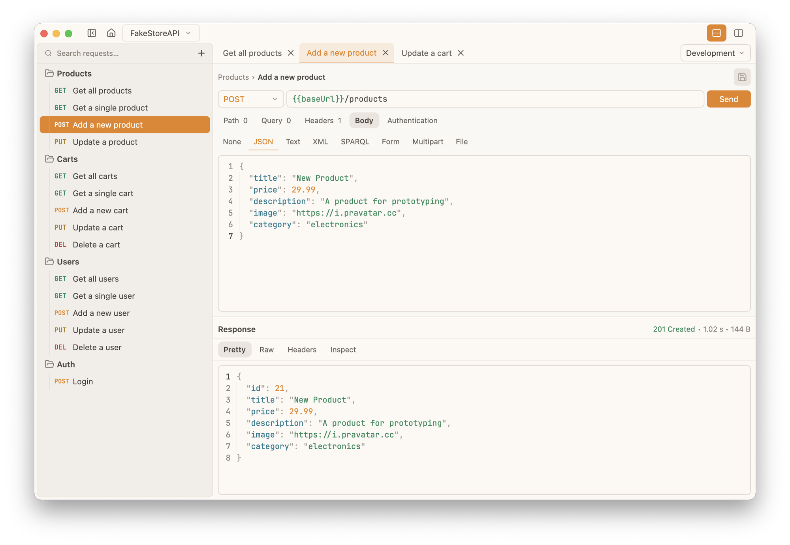

# Probe

Probe is a fast, native, local-first API client built for humans and agents. It is written in Rust on GPUI, so the desktop app is GPU-rendered without Electron or a WebView, starts instantly and stays light on memory. There is no account, no cloud service and no telemetry: collections are plain files on your disk, and the same Rust core also powers a command-line interface for scripts, CI and AI coding agents.

## Collections that live in Git

Workspaces are stored as OpenCollection YAML, a readable, diff-friendly format that fits naturally into a repository next to the code it exercises. Existing OpenCollection collections open as they are, and Postman and Yaak collections can be imported. Requests are organized into folders in the sidebar, searchable by name and instantly navigable even in very large collections.

## Build and send requests

Each request opens in its own tab with method, URL, path and query parameters, headers, body and authentication laid out in a compact editor. Bodies can be JSON, text, XML, SPARQL, form, multipart or file uploads, with syntax-highlighted editing for structured formats. HTTP and GraphQL requests are supported. Environments such as development and production hold variables like a base URL, support inheritance and overrides, and are switched from the toolbar.

## Read responses faster

The response panel shows status, timing and size at a glance, with pretty, raw and header views. Response intelligence highlights useful details automatically, such as decoding JSON Web Tokens and translating timestamps, so common inspection steps need no extra tooling.

## A CLI for automation and agents

The CLI exposes the same collections non-interactively: validate a collection, list its requests, run a request against a chosen environment and import collections from other tools. Output is available as human-readable text or deterministic, versioned JSON with well-defined exit codes, which makes Probe a good fit for shell automation, continuous integration, headless environments and AI coding agents working on an API.

## Status

Probe is under active development and ships desktop and CLI builds for macOS, Windows and Linux. WebSocket, gRPC streaming, custom themes, Git integration and secret storage are on the roadmap.

[Official website](https://rusty-probe.pages.dev) · [GitHub repository](https://github.com/crizant/probe)
