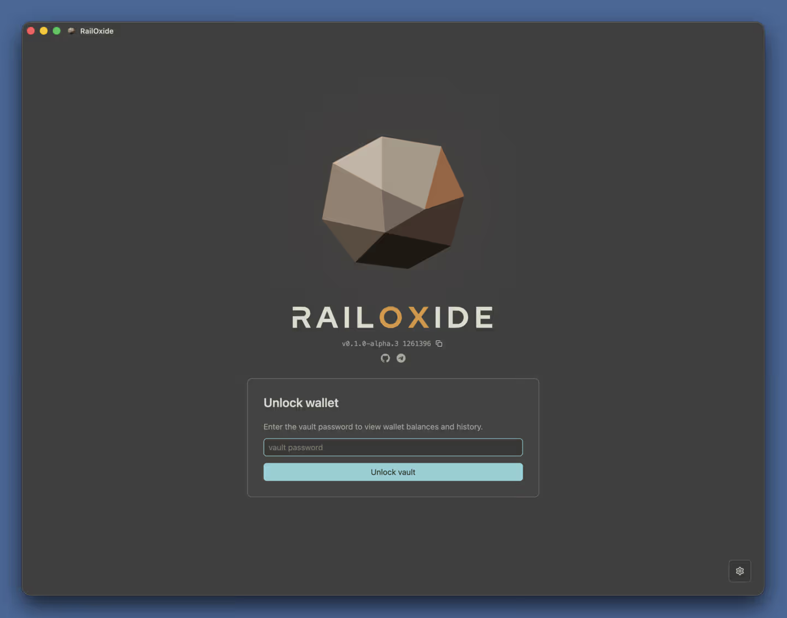
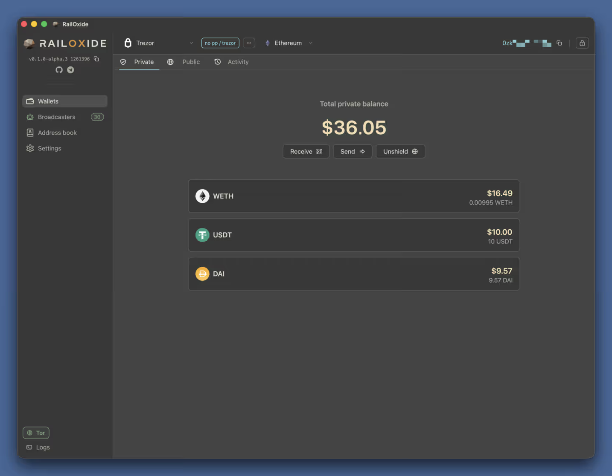
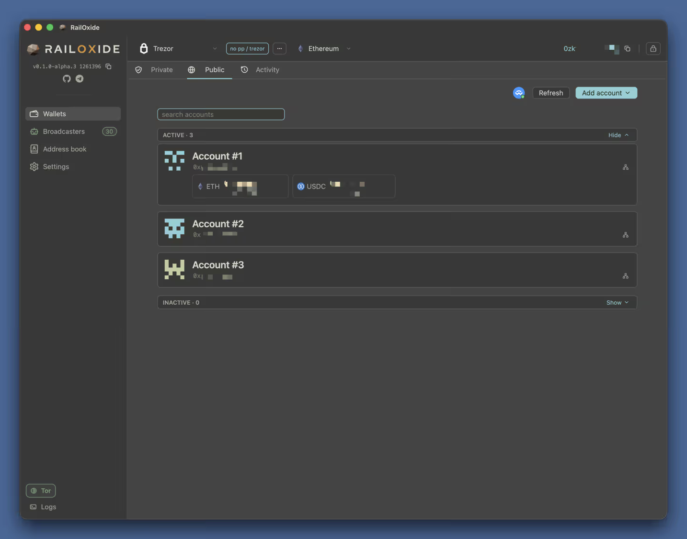
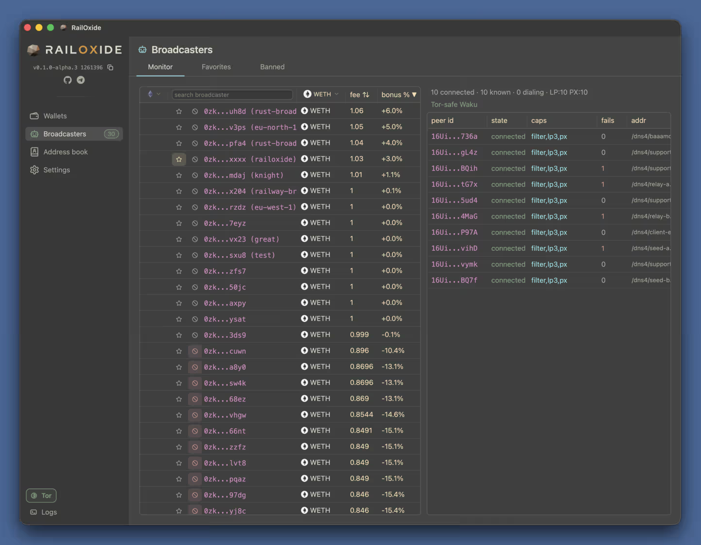
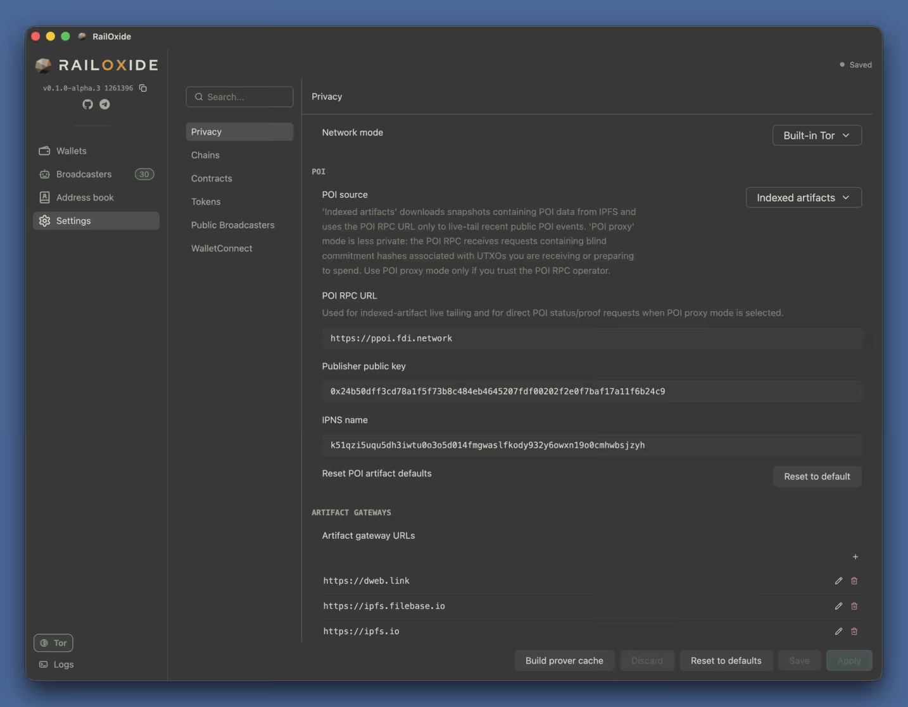

# RailOxide

RailOxide is an open-source desktop wallet for private transactions on the RAILGUN protocol. It is written in Rust and rendered natively with GPUI, and it is built around one idea: your wallet should not talk to anyone it does not have to. There is no telemetry and no home call, network traffic can be routed through a bundled Tor client, and the data the wallet needs for proofs is fetched in a way that does not reveal which notes you intend to spend.

## Private and public balances in one place

The Wallets view separates the two sides of a RAILGUN wallet. The Private tab shows the total shielded balance with per-token rows for assets such as WETH, USDT and DAI, together with Receive, Send and Unshield actions. The Public tab lists the ordinary on-chain accounts behind the wallet, each with its identicon, address and token balances, grouped into active and inactive sets with search, refresh and add-account controls. The Activity tab keeps the history of shields, transfers and unshields. A chain selector in the header switches networks, and the current 0zk address is always one click away to copy.

## Hardware-derived wallets

Ledger and Trezor devices are supported for both sides of the wallet. Public accounts have full hardware wallet support. 0zk accounts are derived deterministically by asking the device to sign a hash, so the private key material is never stored in the app; it is only briefly held in memory when a private spend has to be signed. Multiple profiles, including passphrase-protected ones, can live side by side and are picked from the wallet selector.

## Broadcaster monitoring

Private transactions are relayed by public broadcasters. RailOxide keeps a live monitor of the broadcaster network with fee and bonus columns per token, favorites and a ban list, plus a peer table for the underlying Waku connections showing state, capabilities, failures and addresses. Connection management is resilient to churn, and suspicious broadcasters can be filtered using on-chain pricing rather than a third-party price feed. On Mainnet, a block-builder sponsored self-broadcasting mode lets an empty or underfunded account send private transactions without relying on public broadcasters at all.

## Privacy model you can configure

The Settings page exposes the privacy posture directly. Network mode defaults to built-in Tor, with direct and proxy modes available when you explicitly choose them. POI source defaults to indexed artifacts, which download Proof of Innocence snapshots from IPFS and only live-tail recent public events from the POI RPC, so blinded commitments tied to your UTXOs are never sent to the POI operator. Artifact gateways, the publisher key and IPNS name can all be edited, and a prover cache can be prebuilt for faster proofs. Chains, contracts, tokens, public broadcasters and WalletConnect each have their own settings section.

## Everyday details

Token prices are read from on-chain Chainlink oracles, so nothing about your holdings leaks to a pricing API. RPC requests are batched aggressively to stay under provider limits. An address book stores frequently used 0zk and public addresses, and WalletConnect lets the private wallet participate in DeFi applications. A log panel and a Tor status indicator sit at the bottom of the sidebar for quick diagnostics.

## Status

RailOxide is alpha software under active development. Wallet storage formats, APIs and UI flows may change before a stable release, and it interacts with real cryptocurrency networks, so keep offline backups of recovery material and verify every transaction before signing.

[Website](https://railoxide.eth.link) · [GitHub repository](https://github.com/triamazikamno/railoxide)
