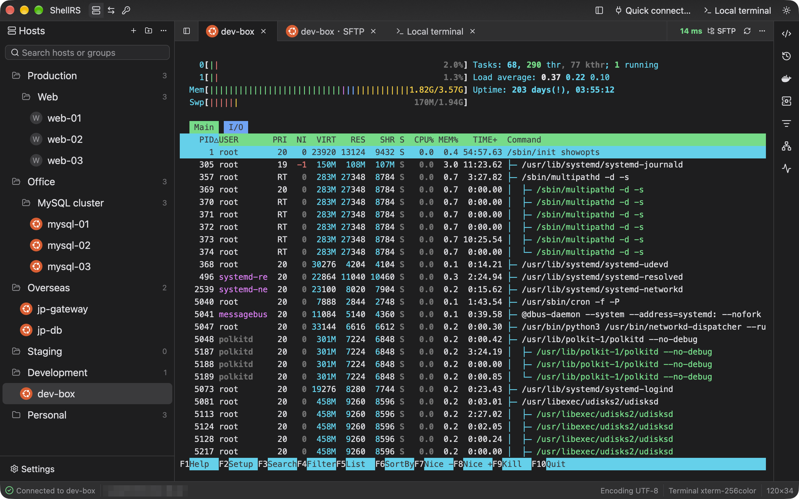

# ShellRS

ShellRS is a native, cross-platform SSH client written in Rust, with a GPU-rendered interface built on GPUI Kit. Xshell-style host management and tabbed terminals, a WinSCP-style dual-pane SFTP browser and SSH port forwarding share one window, and bastion hosts such as JumpServer can launch it the way they launch Xshell and WinSCP. There is no Electron and no JVM.

## Hosts and terminals

Hosts sit in groups nested to any depth, rearranged by dragging and found by typing. The remote OS is detected on connect and shown as a badge in the host tree and on tabs. A host connects directly, through a chain of jump hosts, or through an HTTP or SOCKS5 proxy, and "Test connection" performs a real login and explains any failure.

Remote and local terminals open in tabs and are built on Alacritty's terminal core, so full-screen programs such as vim and htop behave as expected. Each tab shows its SSH round-trip latency live. Tabs can be dragged into side-by-side or stacked splits, for example to watch a terminal and an SFTP browser for the same host together.

## WinSCP-style SFTP

A dual-pane browser modeled on WinSCP Commander, with symmetric local and remote panes, bookmarks and the familiar function-key shortcuts. Files move by dragging or by shortcut, folders included, through a per-tab transfer queue that shows progress, speed and time left. Transfers survive dropped connections, which are retried automatically, and after a restart ShellRS offers to resume an unfinished transfer. Text files open in a built-in editor with syntax highlighting and are saved back in place after checking that nobody else changed them; images and Markdown can be previewed.

## Server tools in the sidebar

A right sidebar follows the current remote terminal and works over that terminal's own connection, with no second login. On Linux servers it shows a system monitor (CPU per core, memory, network and disks), network connections, processes, and systemd services with their logs. Docker containers are grouped by compose project, alongside volumes, images and networks. The host's command history and a shared library of snippets are one click away from the terminal.

## Port forwarding

Local, remote and dynamic (SOCKS) forwards. The rule editor draws a live diagram and a one-line explanation of where connections enter and where they go. Every rule keeps its own SSH connection, reconnects after a drop, and can start together with ShellRS.

## Opening from a bastion host

Bastion hosts such as JumpServer can use ShellRS as their SSH and SFTP client: an SSH link opens a terminal and an SFTP link opens a file browser. ShellRS understands the launch arguments of Xshell and WinSCP, and when it is already running the link opens in the same window. The connection it opens stays out of the host list and keeps the link's password in memory only.

## Built for AI agents

ShellRS ships a command-line tool that lets coding agents such as Claude Code or Codex list saved hosts, run commands, and upload, download or sync files. The running app logs in on the agent's behalf, so the agent never reads a password or private key, and an unknown host or a missing password fails at once with a stable error code instead of a prompt that would hang the agent. The tool and an Agent Skill are installed from the settings page.

## Security and updates

Hosts, groups, credentials and forwarding rules live in a local SQLite database, while passwords and key passphrases go only into the system keychain (macOS Keychain, Windows Credential Manager or Linux Secret Service). Credentials can be shared by many hosts, and keys can be generated on the spot. Updates are signed, verified and downloaded in the background, then installed on restart.

[Official website](https://shellrs.com) · [GitHub repository](https://github.com/since2006/shell-rs)
