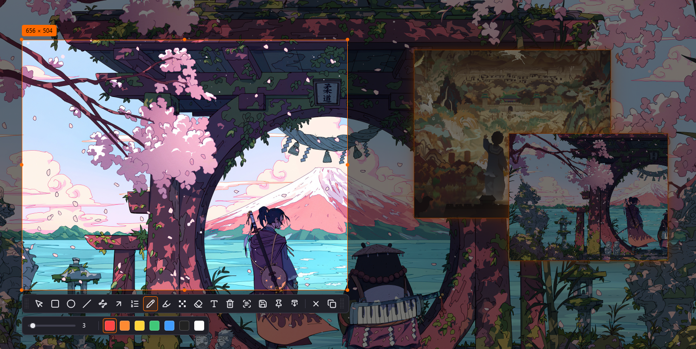

# Shotori

A Wayland-native screenshot tool. Freeze the screen, drag a selection,
and send it where it needs to go — the clipboard, a file, plain text,
a pinned floating copy, or one long stitched page.

## Main features

- Region selection across multiple monitors, including mixed scales
  and rotated outputs
- Annotations: rectangles, ellipses, arrows, numbered steps, pencil,
  highlighter, mosaic and text — all editable after the fact
- On-device OCR: turn a selection into plain text; fully local after a
  one-time model download
- Pin: crop a selection into an always-on-top floating image — drag it
  across screens, scroll to zoom
- Long screenshots: stitch scrolling content into one image, with a
  live preview of the growing page
- Copy to clipboard or save via the system dialog; optional tray icon,
  light/dark themes

[Source on GitHub](https://github.com/shotori-screenshot/shotori)
