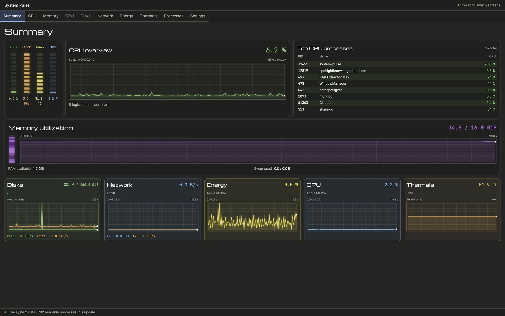

# System Pulse

System Pulse is a native desktop system monitor built with Rust and GPUI Kit. It turns live host telemetry into a single dashboard of charts, meters and tables, so you can watch load, memory pressure, storage throughput, network activity, power draw and temperatures without leaving one window.

## Screens

A fixed tab strip keeps every view one click apart:

- **Summary** — combined CPU, clock, temperature and GPU meters, a rolling CPU history chart, top processes by CPU, memory utilization with swap, and compact cards for disks, network, energy, GPU and thermals.
- **CPU** — overall load plus per-logical-processor charts and current clock speeds.
- **Memory** — used and available memory over time, with swap usage.
- **GPU** — utilization history for the detected graphics device.
- **Disks** — capacity and read/write throughput per volume.
- **Network** — receive and transmit rates per interface.
- **Energy** — instantaneous power draw and its recent trend.
- **Thermals** — sensor readings and their range over the sampled window.
- **Processes** — a searchable, sortable process table with confirmed actions.
- **Settings** — device selectors, update interval, theme and named presets.

## Live data and history

Every chart keeps a rolling window of samples, labelled with its own scale and time span, so a spike stays visible after the moment passes. Values refresh on a configurable interval and read from the real host — process counts, readable-process totals and per-device figures all reflect what the machine is doing right now.

## Tray monitoring

A small tray graph shows combined CPU load. Closing the dashboard keeps collection and history running in the background while the tray icon stays available; reopening returns to the screen you were last on. Where no tray host is present, closing the window exits normally.

## Presets and themes

Device selections, sort order, search terms and update settings can be saved as named presets and restored later. Dark and light themes are both supported, and the interface uses native charts and segmented meters rather than embedded web views.

## Platforms

Linux is the primary verification platform, with macOS covered by the same codebase. The project is open source under GPL-3.0-or-later at [github.com/eas4ai/system-pulse](https://github.com/eas4ai/system-pulse).
