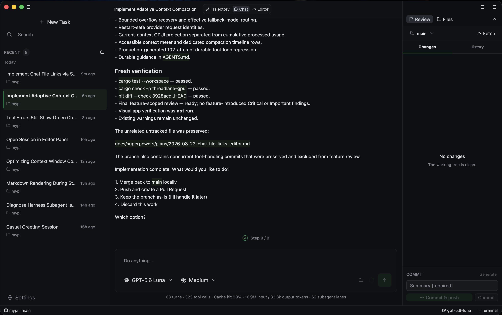

# Threadlane

Threadlane is a native workspace for AI-assisted software development, built with Rust and GPUI Kit. It brings project conversations, coding agents and developer tools into one desktop application for macOS and Linux.

## Develop in one workspace

- Organize multiple projects and persistent conversation sessions, with branching session history.
- Follow streamed coding-agent activity, plans and execution history alongside your project.
- Work with integrated terminals, file editing, project search and Git review panels.
- Connect supported model providers and external ACP agents, and extend workflows with MCP servers, discovered skills and sandboxed WASI extensions.
- Schedule recurring prompts with run history and optional isolated Git worktrees while the app is open and the computer is awake.

Threadlane and its screenshot are by wheregmis. The screenshot is reproduced unchanged from the official project repository; ownership remains with its original author. Learn more in the [official project repository](https://github.com/wheregmis/threadlane).
