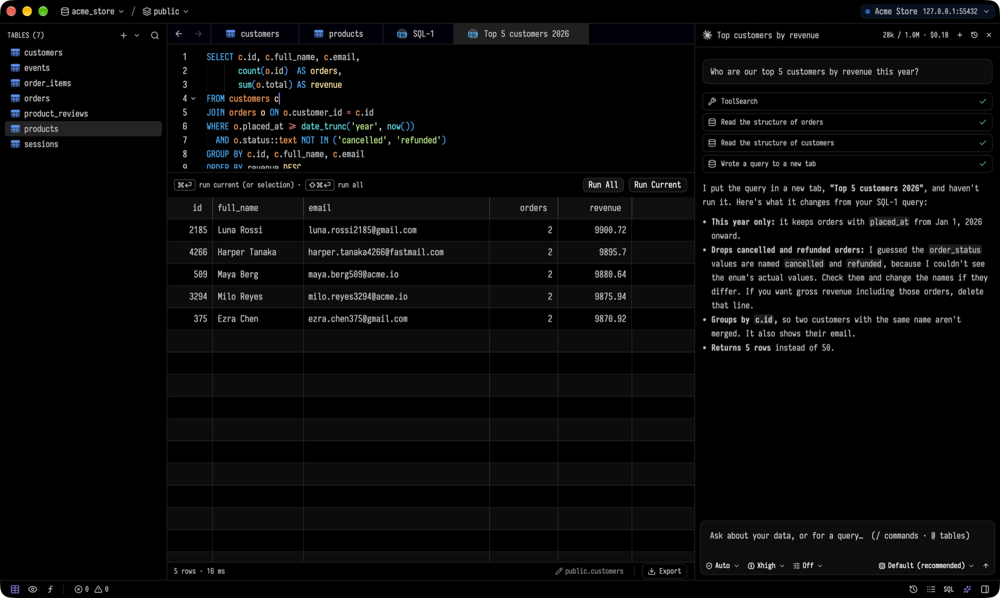

# Tusk

Tusk is a native database client for macOS, Windows and Linux, built with Rust and GPUI Kit. It brings connection management, data editing and SQL queries into a keyboard-driven workspace.

## Work with your databases

- Connect to PostgreSQL, MySQL, SQLite, SQL Server, Redis, MongoDB and other SQL and NoSQL databases.
- Organize connections with groups and tags, and connect through SSH tunnels.
- Edit rows in a data grid, review pending changes, and inspect table structures and indexes.
- Write SQL with completions, run individual statements or a full query tab, and revisit query history.
- Ask an AI assistant to inspect a schema and draft a query. You review the query and decide when to run it.
- Export tables and query results as CSV, JSON or SQL.

Tusk and its screenshot are by Alpcan Aydın. Learn more in the [official project repository](https://github.com/alpcanaydin/tusk).
