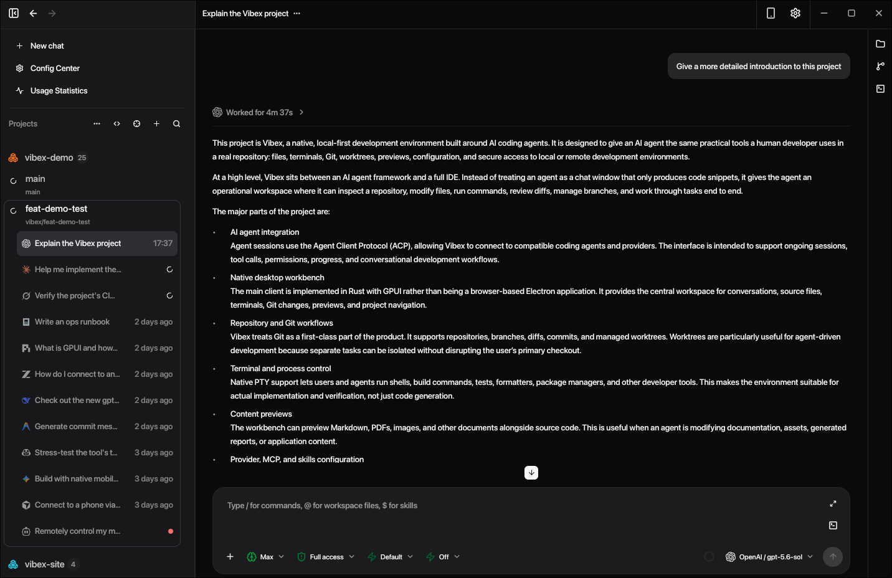
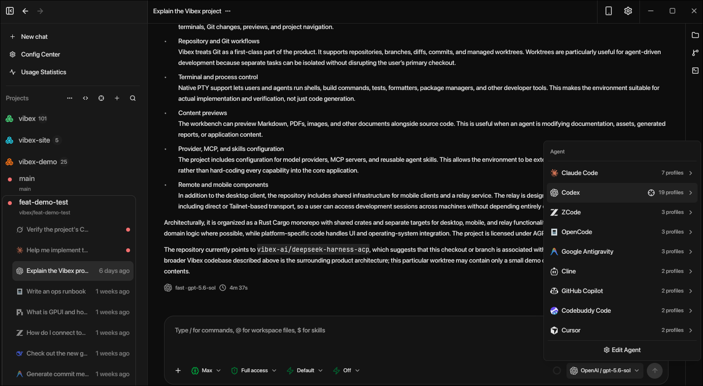
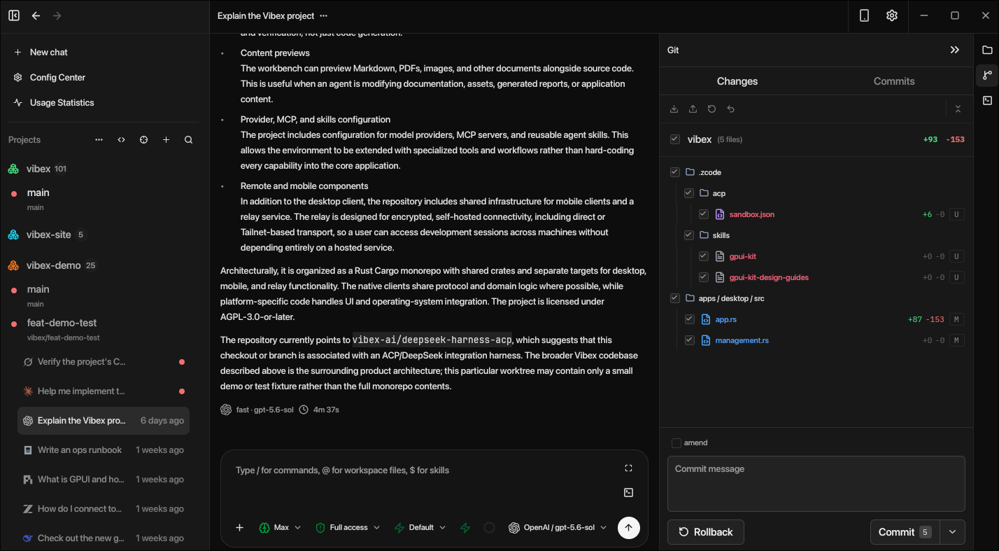
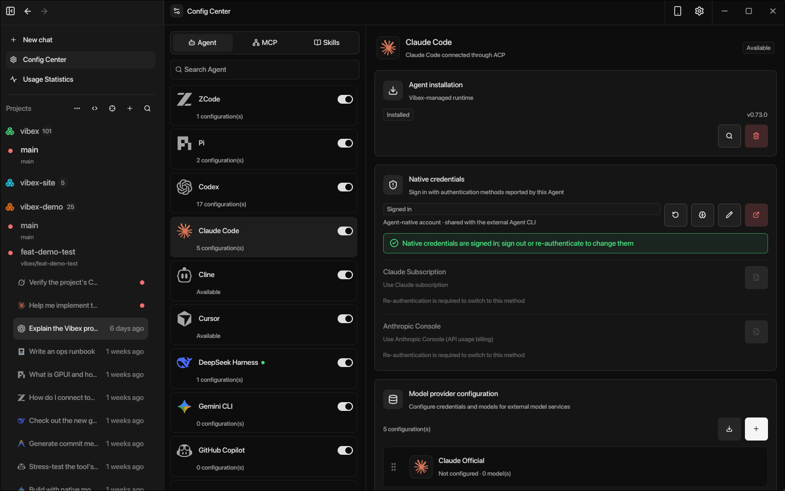
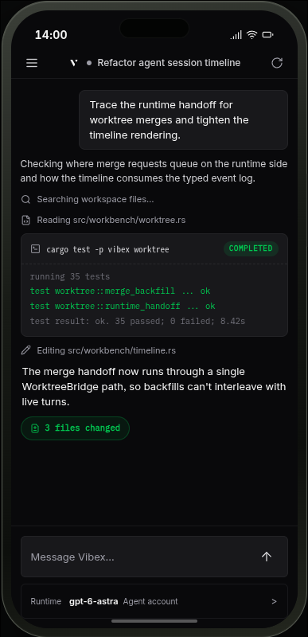

# Vibex

Vibex is a native, local-first AI coding workbench built with Rust and GPUI(GPUI-Kit). It brings agent sessions, source code, Git, terminals, previews, and provider configuration into one focused desktop workbench, and keeps your repository, credentials, and session state on the machines you choose.

## Run agents in one place

Every online agent session uses the Agent Client Protocol (ACP) through managed adapters, so any ACP-compatible agent — Claude Code, Codex, ZCode, OpenCode, Gemini CLI, and more — runs in Vibex with a shared session, capability, permission, and terminal surface. Sessions stream as a structured timeline with Markdown, reasoning, plans, tool and process details, attachments, approvals, and typed elicitation forms. You can stop, continue, fork, rename, and resume sessions, or import supported local histories.

## Review and ship changes

Workspace-scoped file trees, name and content search, and revision-checked file editing sit alongside native Git tooling: status, history, diffs, and blame; branch creation and switching; staging, reverting, committing, fetching, and pushing; and isolated Git worktrees with guarded merge and rebase recovery. Native PTY terminals provide ANSI emulation, tabs, resize, scrollback, and search, while built-in previews render Markdown, images, PDFs, and supported Office documents.

## Configure agents your way

The agent and provider center discovers and manages agent runtimes, selects models and reasoning options, authenticates providers, and runs health and capability probes. MCP servers, Skills, Prompts, and Hooks can be imported, validated, and scoped to reusable workflows without scattering configuration across home directories. Automation schedules one-shot, interval, or daily agent runs with explicit run state, recovery, and audit history.

## Stay in the loop anywhere

Desktop notifications flag completed, failed, or input-blocked sessions, and unread completions stay tracked across restarts. A native mobile companion pairs with the desktop runtime to read the same agent timeline, approve or decline requests, send follow-ups, inspect files and Git state, and use remote terminal surfaces. Pairing works over Direct connections, a Tailnet, or your own self-hosted relay that forwards only encrypted frames.

## Run a headless runtime in the cloud

For development on a remote machine, Vibex ships the same workbench core as a headless server. Workspaces, agent CLIs, terminals, Git, and provider configuration run on the cloud host, while desktop and mobile clients connect as paired remote clients over the same encrypted Remote v2 gateway — a paired client cannot tell a cloud runtime from a desktop one. Deployment is self-hosted and single-user, with provided Docker Compose and systemd definitions and an optional reverse proxy for TLS. One-time numeric pairing codes register devices, per-device permissions include read-only access, lost devices can be revoked, and provider credentials are write-only, never returned to clients after storage.

[Official website](https://vibex.peatboy.com) · [GitHub repository](https://github.com/vibex-ai/vibex)
