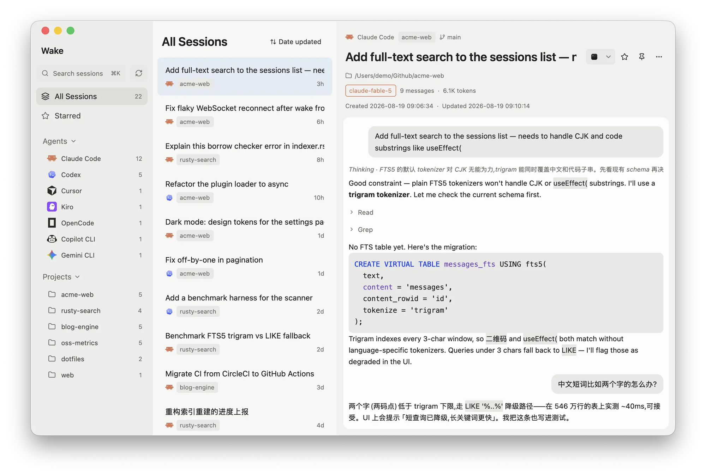
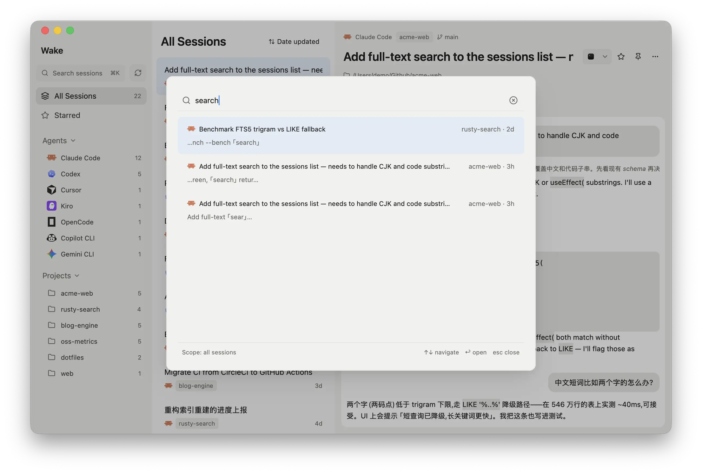

# Wake

Wake is a native desktop app that gathers every coding-agent session on your machine into one place. Your agent history is scattered across a dozen private directories such as the Claude Code, Codex and Cursor data folders. Wake reads them all, read-only, and gives you one fast window to browse, search and resume any conversation in seconds. Built with Rust and GPUI, it starts on macOS, with experimental Linux and Windows support. Everything stays local.

## Unified browsing

All sessions are grouped by agent and by project in the sidebar, with counts for each. Subagent runs nest under their parent session, and live file watching picks up new and updated sessions incrementally without a manual refresh. Wake understands Claude Code, Codex CLI, Cursor CLI transcripts, OpenCode, Kiro, Gemini CLI, Copilot CLI, Pi, Grok Build, Kimi Code, DeepSeek Harness, Hermes Agent, OpenClaw and more, and shows which model and which entry point a session used when the agent records it.

## Full-text search

Press ⌘K to search across every agent's transcripts at once. A SQLite FTS5 trigram index handles CJK text and code substrings such as `useEffect(` equally well, and each result jumps straight to the matched message inside the transcript. Search can be scoped to all sessions or narrowed to what you are looking at.

## Transcript view

Each session renders as a readable conversation: user and assistant bubbles, thinking summaries, collapsible tool-call clusters, inline images that can be copied or saved, and tree-sitter code highlighting for more than thirty languages. Session metadata such as project path, git branch, model, message count, token usage and timestamps sits at the top.

## One-click resume

Reopen any session in your terminal at its original project directory. Wake issues the right resume command for each agent and targets Terminal or iTerm on macOS and native terminal hosts on Linux and Windows.

## Manage your history

Star and pin sessions, export a transcript to Markdown, or save an inline image through the system Save dialog. Favorites are stored in Wake's own database so the original agent files are never modified. Deleting a session moves it to the system Trash and records a tombstone so it stays gone after the next scan.

## Insights

A stats page covers your whole library: a GitHub-style activity heatmap with streaks, hour, weekday and month breakdowns, and Agents, Projects and Models leaderboards that switch between sessions, tokens and prompts.

## Remote hosts

Mirror the sessions on your other machines over SSH. Remote sessions appear next to local ones with a host badge, are searchable like everything else, and resume through a ready-to-paste SSH command. Only session data is copied, and nothing on the remote is ever written.

## Connect your agents

Wake ships a read-only MCP server so Claude Code, Codex, Cursor or any MCP client can search your whole history, list recent sessions per project and read transcripts page by page, letting a new agent pick up where another one left off. A matching command-line tool gives the same answers to anything that can run a shell, and a bundled skill teaches agents to reach for it on their own.

[GitHub repository](https://github.com/iAmCorey/Wake)
